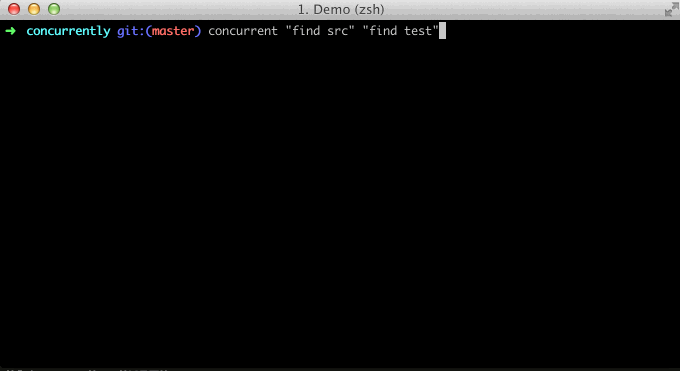

# Concurrently

**Version: 0.0.3** ([*previous stable*](https://github.com/kimmobrunfeldt/concurrently/tree/0.0.2))

Run multiple commands concurrently. Like ```command1 & command2``` but better.



## Usage

Remember to surround separate commands with quotes, like this:
```bash
concurrent "command1 arg" "command2 arg"
```

```
  Usage: concurrent [options] <command ...>

  Options:

    -h, --help             output usage information
    -V, --version          output the version number
    -k, --kill-others      kill other processes if one exits or dies
    --no-color             disable colors from logging
    -p, --prefix [prefix]  prefix used in logging for each process. Possible values: pid, none, command

  Examples:

   - Kill other processes if one exits or dies

       $ concurrent --kill-others "grunt watch" "http-server"

  For more details, visit https://github.com/kimmobrunfeldt/concurrently
```

#### Examples

**Run less watch task and watchify with `--kill-others`` option.
If either one of the processes dies, the other is killed too.**

```bash
concurrent -k "lessc main.less bundle.css" "watchify main.js -o bundle.js"
```

## Install

The tool is written in nodejs, but you can use it to run **any** commands.

```bash
npm install -g concurrently
```

## Why

I like [task automation with npm](http://substack.net/task_automation_with_npm_run)
but the suggested way to run multiple commands concurrently is
```npm run watch-js & npm run watch-css```. That's fine but it's hard to keep
on track of different outputs. Also if one process fails, others still keep running
and you won't even notice the difference.

Another option would be to just run all commands in separate terminals.
No thanks.

